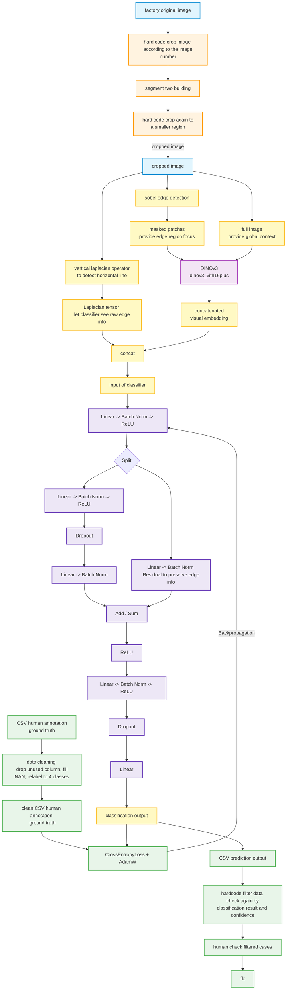

# Complete Model & Training Pipeline (SAM3 + DINOv3 + Classifier)

This diagram visualizes the complete system architecture, data flow, and training/filtering processes extracted from the system documentation.

